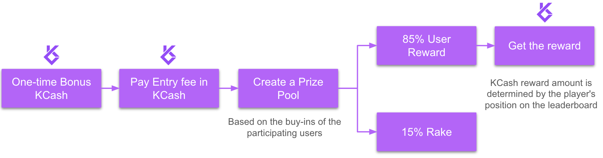
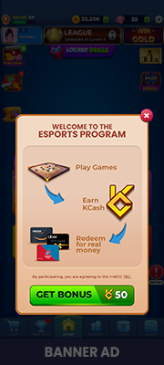
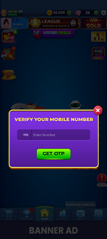
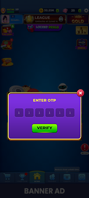
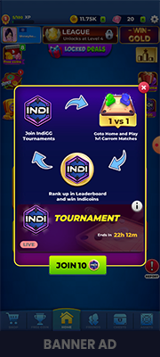
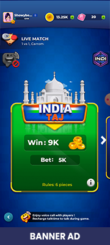
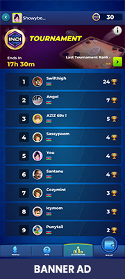
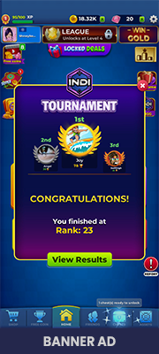
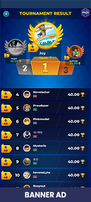

# ESports Protocol

# Description

Tournament system is a key feature of the Kratos ESports Protocol that enables game developers to host tournaments and incentivize players with rewards.

Upon launching the game for the first time post-protocol implementation, a user's in-game wallet is automatically created, and an initial bonus of 50 KCash is deposited. This currency can be used to participate in tournaments.

# Flow Diagram

# User Onboarding

When a player launches the game for the first time the API creates a wallet for the user and deposits with 50 Bonus KCash to enter into on-going tournaments. The player can opt-in to link their wallet with their phone number through an OTP validation to take custody of their wallet. However this is not a mandatory step during the onboarding. The user can opt-in again at the time of redemption.

<!-- 
 -->

# Tournament Leaderboard

When a tournament is active in the game, players have the opportunity to join with an entry fee of 10 KCash. As more participants join, the leaderboard expands, intensifying the competition and the prize pool. These tournaments are defined as 24hr format leaderboard tournaments.

If a player manages to rank in the top 40% of the leaderboard, they can earn up to 6x their entry fee. 
Reward payout structure looks like this 
- Top 1% gets 6x of the entry fee
- Top 10% gets 4x of the entry fee
- Top 20% gets 1.5x of the entry fee
- Top 9% gets 1x of the entry fee

After the tournament concludes, players receive a notification about the results and their reward. 

