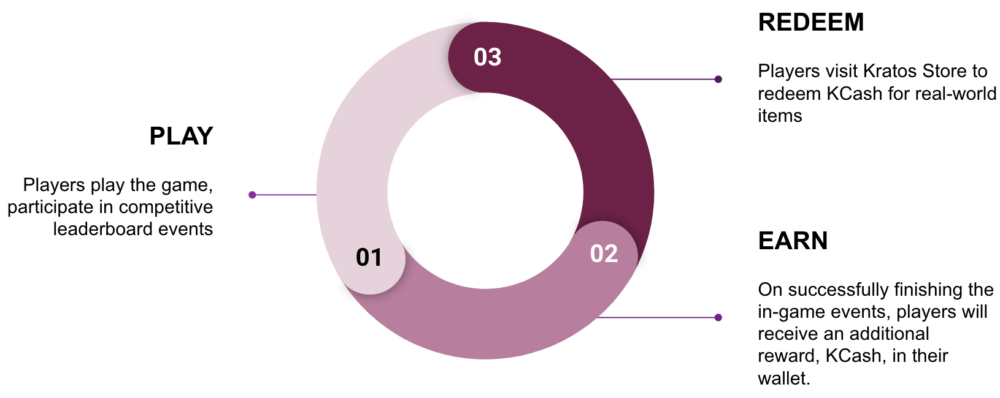

# Introduction 

# Description

Kratos Studios' ESports protocol offers game developers a suite of APIs to seamlessly integrate leaderboard-based competitions into their games. The protocol includes a reward system using KCash, which players can earn by participating in competitive events in the game and redeem for real-world items, such as gift vouchers from the Kratos Store.This approach creates a win-win situation for both players and game developers. It not only enhances the player experience by making the game more rewarding but also ensures that game developers benefit from more engaged and delighted players, ultimately leading to an increase in player LTV.Building with Kratos is a swift and straightforward process. Get in touch with us to explore the possibilities!

# Developer's Point of view

ESports protocol provides game developers with an easy-to-use API into their existing games and set up leaderboard-based competition. By leveraging it, developers can enhance the competitive gaming experience for their players while also opening up new avenues for engagement and monetization within the games.
 
The objective of this document is to give you a quick familiarity with the protocol. For deeper technical details, [read here](/docs/category/tech-integration).

# Player's Point of view

The ESports protocol values players' competitive skills in the game, rewarding them with KCash, a currency with tangible benefits. This currency can be redeemed for a diverse range of items available at the Kratos Store. The player's journey is as follows:

As players progress through their journey, they are motivated to play more and earn additional KCash, creating a positive feedback loop.
