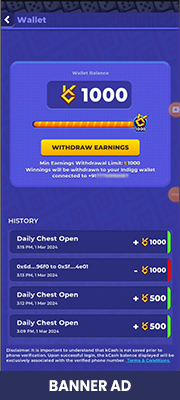
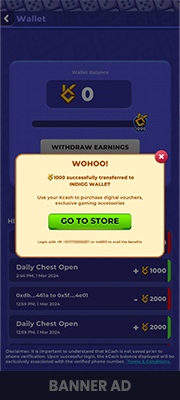
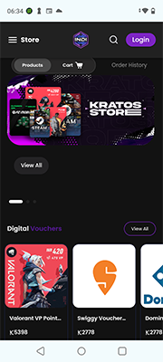
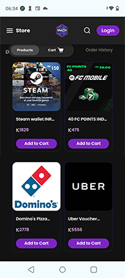
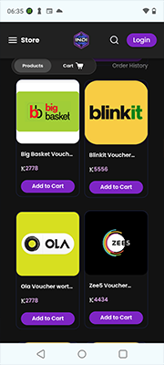
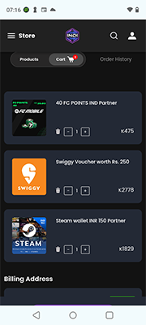

# KCash and Kratos Store

# Introducing KCash

KCash is a currency that rewards players for playing games. What sets KCash apart is its usability beyond the game, allowing players to redeem it for real-world rewards.

# KGeN Wallet

When a player joins, the API automatically generates a wallet to provide joining bonus KCash to the player and to manage the earned KCash acquired during gameplay. Once the balance reaches 1000 KCash, the player can initiate a withdrawal process by verifying their phone number via OTP and taking custody of their wallet.

Players have the option to download the [KGeN mobile App](https://play.google.com/store/apps/details?id=com.indiggcommunity&hl=en&gl=US) from the Google Play Store or visit the [website](https://kgen.io/gamer), where they can sign up and verify their identity using the same mobile number. This allows them to link both wallets and transfer their earned KCash for redemption of real-world rewards.

# Kratos Store
Kratos Store is the go-to destination for gamers looking to redeem their hard-earned KCash. The store offers a range of products, including Steam Vouchers, Game currency packs, gift vouchers, gaming cards, gaming accessories and merchandise.

Check out the [store](https://kgen.io/gamer/k-store), it’s live! 

