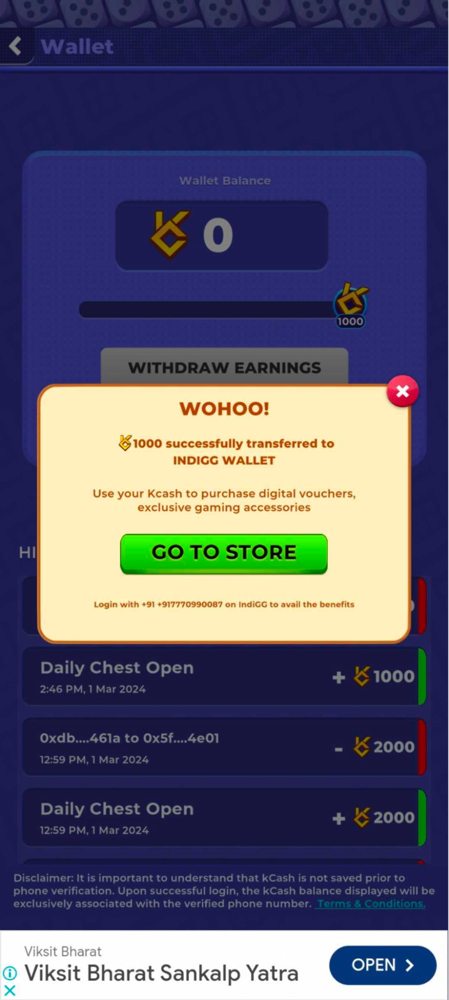
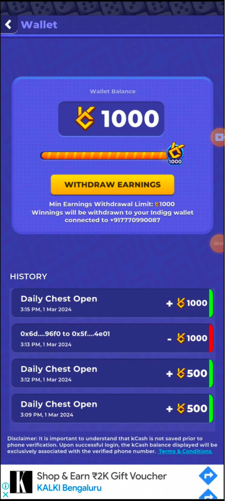

# Kcash and Kratos Store

# Introducing Kcash

KCash is a currency that rewards players for playing games. What sets KCash apart is its usability beyond the game, allowing players to redeem it for real-world rewards.

# Kgen Wallet

When a player joins, the API automatically generates a wallet to provide joining bonus KCash to the player and to manage the earned KCash acquired during gameplay. Once the balance reaches 1000 KCash, the player can initiate a withdrawal process by verifying their phone number via OTP and taking custody of their wallet.

Players have the option to download the IndiGG mobile App from the Google Play Store or visit the website, where they can sign up and verify their identity using the same mobile number. This allows them to link both wallets and transfer their earned KCash for redemption of real-world rewards.

# Use of Kcash

When a player joins, the API automatically generates a wallet to provide joining bonus KCash to the player and to manage the earned KCash acquired during gameplay. Once the balance reaches 1000 KCash, the player can initiate a withdrawal process by verifying their phone number via OTP and taking custody of their wallet.

Players have the option to download the IndiGG mobile App from the Google Play Store or visit the website, where they can sign up and verify their identity using the same mobile number. This allows them to link both wallets and transfer their earned KCash for redemption of real-world rewards.

