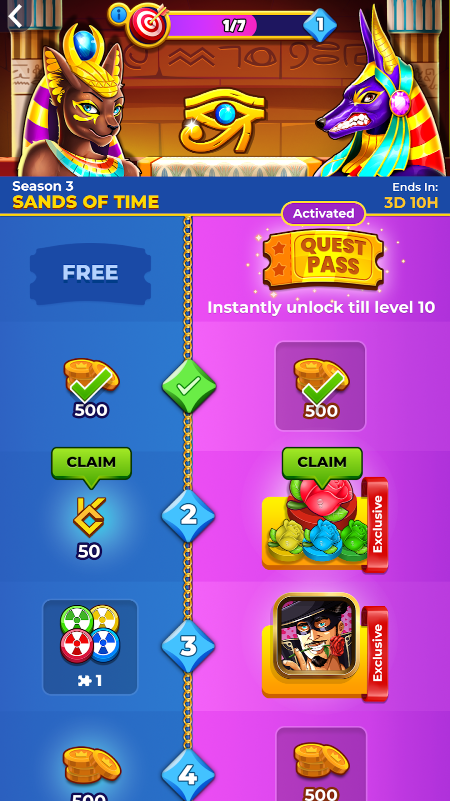
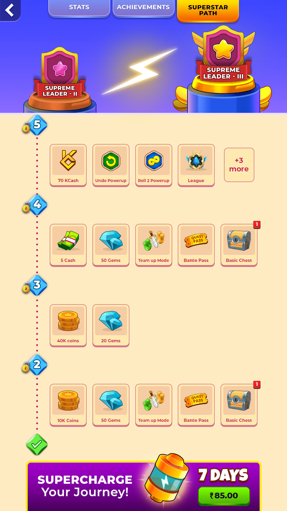

---

sidebar_position: 1
---

The Loyalty protocol rewards dedicated players in the game. These players, who are consistently engaged and participate in quests and events, now receive extra rewards in the form of KCash.

Upon launching the game for the first time post-protocol implementation, a user's in-game wallet is automatically created, and an initial bonus of 50 KCash is deposited. 

## Flow Diagram

## User Onboarding

When a player launches the game for the first time the API creates a wallet for the user and deposits with 50 Bonus KCash to enter into on-going tournaments. The player can opt-in to link their wallet with their phone number through an OTP validation to take custody of their wallet. However this is not a mandatory step during the onboarding. The user can opt-in again at the time of redemption.

## Battle Pass Events

Players can earn KCash as they progress through the Battle Pass events.

## Daily and Weekly Quests

Players have the opportunity to earn extra rewards through daily and weekly quests and other in-game events. These quests allow players to earn KCash as a reward for their participation and progress.

## Special Events

Players have the opportunity to earn KCash by participating in Seasonal and Special events.

