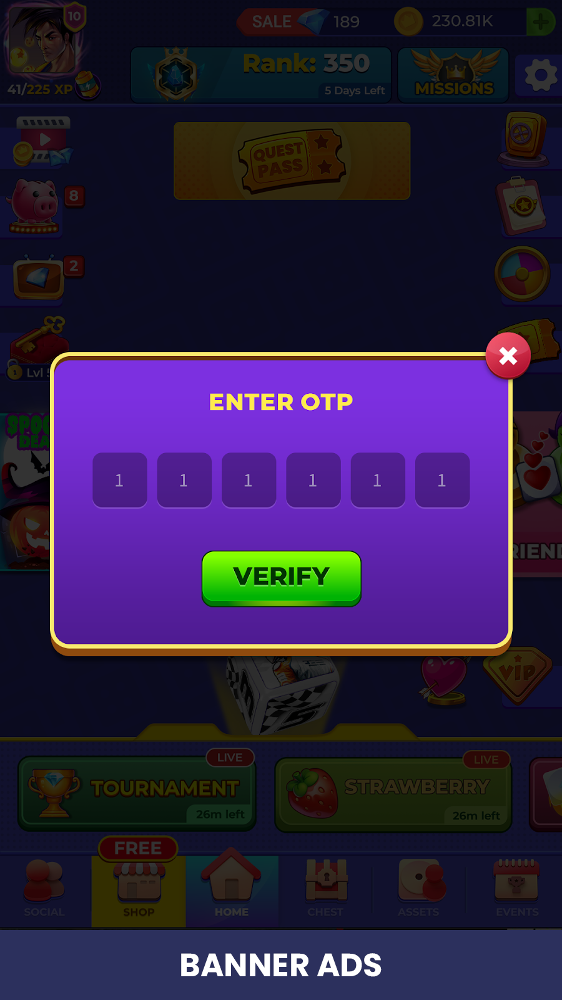
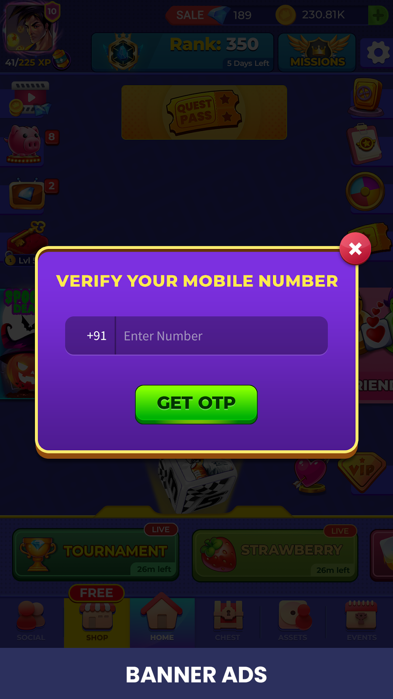
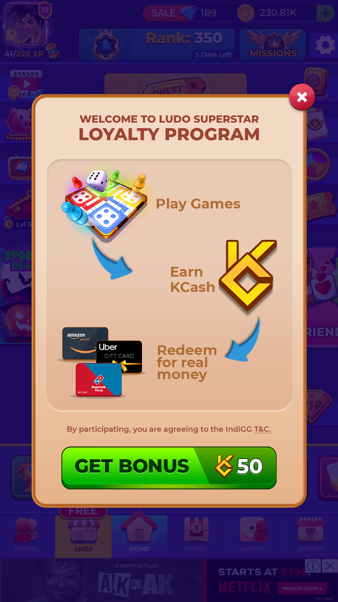

---

sidebar_position: 2
---
When a player launches the game for the first time the API creates a wallet for the user and deposits with 50 Bonus KCash to enter into on-going tournaments. The player can opt-in to link their wallet with their phone number through an OTP validation to take custody of their wallet. However this is not a mandatory step during the onboarding. The user can opt-in again at the time of redemption.

