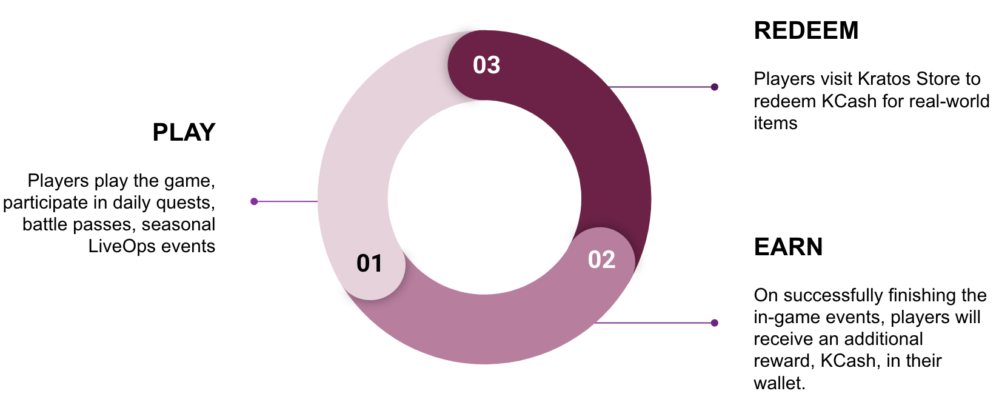

## Developer's Point of view
Loyalty protocol provides game developers with an easy-to-use API to integrate a new loyalty reward currency, KCash. This enables developers to incentivize players who participate in daily quests, battle pass challenges, and other game-specific LiveOps events with KCash. By leveraging it, developers can enhance the experience for their loyal and engaged players while also opening up new avenues for engagement and monetization within their games.

The objective of this document is to give you a quick familiarity with the protocol. For deeper technical details, read here.

## Player's Point of view

The Loyalty protocol values players' dedication in the game, rewarding their loyalty with KCash, a currency with tangible benefits. This currency can be redeemed for a diverse range of items available at the Kratos Store. The player's journey is as follows:

As players progress through their journey, they are motivated to play more and earn additional KCash, creating a positive feedback loop.